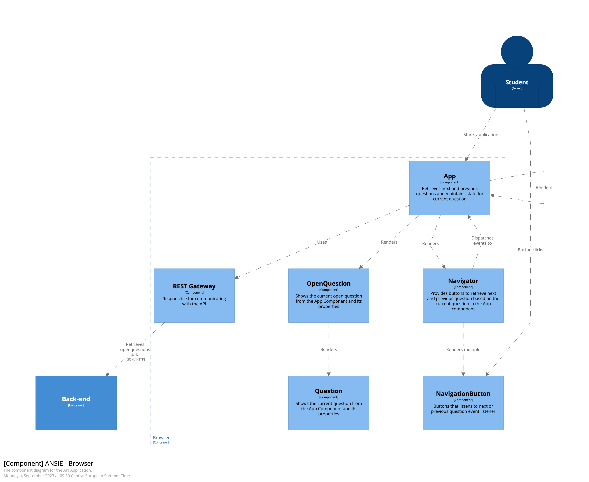
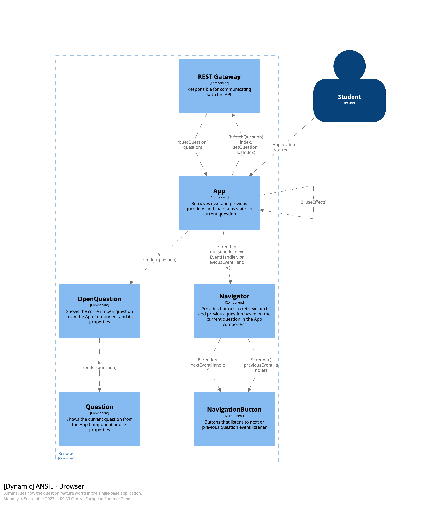
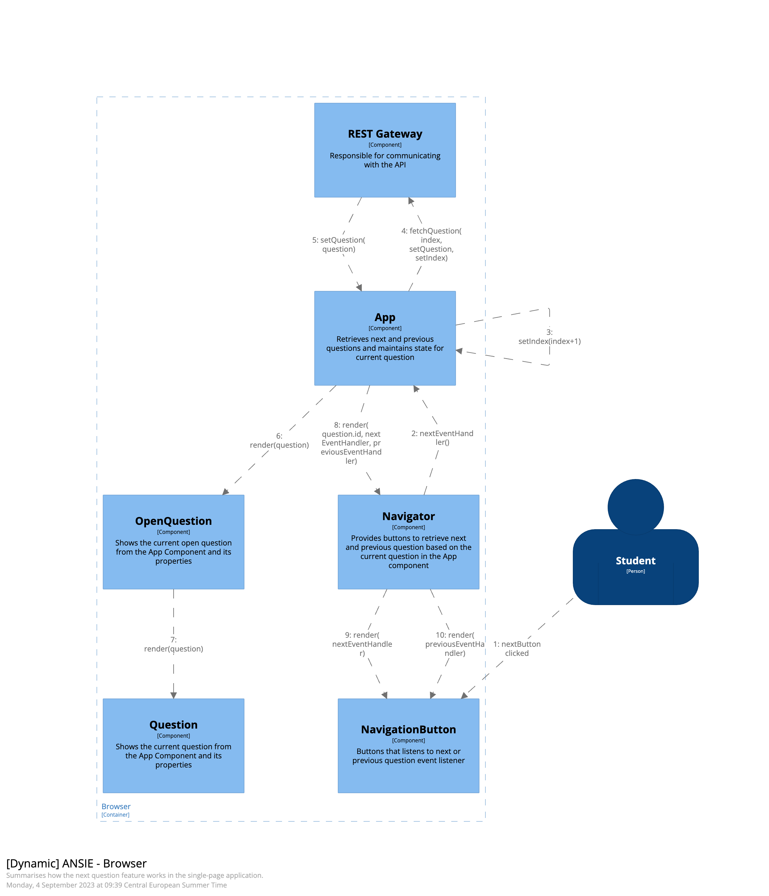

# Weekopdracht 2 voor de cursus TEEX

## Introduction
De applicatie "ANSIE" betreft een prototype van een toetsapplicatie. Op dit moment is de applicatie alleen geschikt om door een aantal toetsvragen heen te navigeren die beschikbaar zijn in de back-end.  

## Context
Je kunt behalve door de toetsvragen heen navigeren ook je antwoord invoeren. Dat antwoord wordt niet opgeslagen of onthouden maar dat is voor deze opdracht niet relevant.

## Functional Overview
In deze applicatie staan toetsvragen centraal. De back-end ondersteunt verschillende vraag-types maar de front-end alleen open vragen. Voor de front-end kan worden uitgebreid met bijvoorbeeld multiple-choice vragen moet er kritisch gekeken worden naar het state management van de React applicatie. Op dit moment is er alleen een user-interface voor de student, docenten kunnen wel vragen toevoegen, aanpassen en verwijderen maar dat moet rechtstreeks in de database.

## Quality Attributes

Modularity
* Een aanpassing aan een React component heeft een minimale impact op andere React componenten in deze applicatie.

Reusability
* Bestaande componenten, in elk geval de Navigator, moeten kunnen worden hergebruikt in andere applicaties. 

Volgens de architecten die het prototype gemaakt hebben wordt er nog onvoldoende aan deze quality attributes voldaan. De oorzaak ligt volgens hen in onhandig state management
* prop drilling
* function passing
* gebruik van [conditional rendering](https://react.dev/learn/conditional-rendering) met if-else.

De architecten hebben twee mogelijkheden voor ogen om dit state management te verbeteren:
1. Gebruik van Composition.
2. Gebruik van de Context API.

## Principles

Deze applicatie bouwt voort op de onderstaande principes uit semester 1:

Back-end
* Package by layer 
* Embedded Application Server
* Dependency Injection
* JDBC Templates

Front-end
* Prop-drilling 
* Function passing
* Conditional Rendering

## Software Architecture

### Container Diagram


### Component Diagram







## Deployment

### Software
React
Java 17
Spring Boot
MySQL

### Building

Back-end
```mvn package```

Front-end
```npm run build```

### Configuration
Back-end: backend/.env bevat poorten en gebruikersnaam/wachtwoord voor toegang tot de database.

Front-end: Geen configuratie.

## Operation and Support 

### Back-end
Run de back-end met Docker Compose:

```docker-compose up```

Gebruik de opties ```--build --force-recreate``` om het backend image geforceerd opnieuw te laten bouwen.

### Front-end
Run de front-end:

```npm run start```
